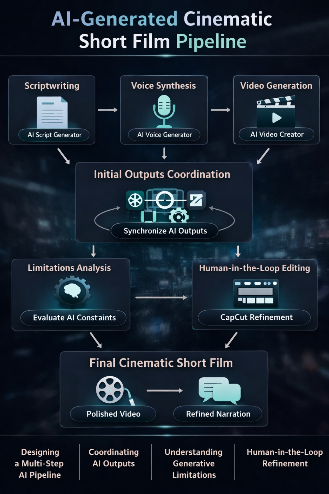

# AI-Generated Cinematic Short Film Pipeline

This project demonstrates an end-to-end AI-assisted workflow designed to
generate a cinematic short film from a high-level concept using multiple
generative AI systems and human-in-the-loop refinement.

## Pipeline Architecture

## Workflow Overview

1. **Scriptwriting**
   - Generated narrative scripts using large language models.
   - Focused on cinematic pacing and scene structure.

2. **Voice Synthesis**
   - Converted scripts into AI-generated voice narration.
   - Adjusted tone and pacing to match the visual narrative.

3. **Video Generation**
   - Created AI-generated video clips based on scripted scenes.
   - Managed variability and consistency issues across generated outputs.

4. **Output Coordination**
   - Synchronized script, voice, and video outputs.
   - Ensured alignment between narration timing and visuals.

5. **Limitations Analysis**
   - Evaluated constraints of generative models such as continuity issues,
     visual inconsistency, and narration drift.

6. **Human-in-the-Loop Editing**
   - Performed trimming, sequencing, and refinement using CapCut.
   - Ensured narrative coherence and cinematic flow.

## Key Focus Areas

- Designing a multi-step AI orchestration pipeline
- Coordinating outputs from independent generative systems
- Understanding limitations of generative AI tools
- Applying human judgment for refinement and quality control

## Tools & Platforms

- Generative AI tools for scriptwriting, voice synthesis, and video generation
- CapCut for post-processing and refinement

## Notes

This project focuses on workflow design and AI system orchestration rather than
model training or algorithm development.

## Prompt Engineering

The `prompts/` directory documents how generative AI systems were guided
using structured prompts to produce narrative, voiceover, and visual outputs.

The focus was on orchestration, constraint design, and human-in-the-loop
refinement rather than model development.
